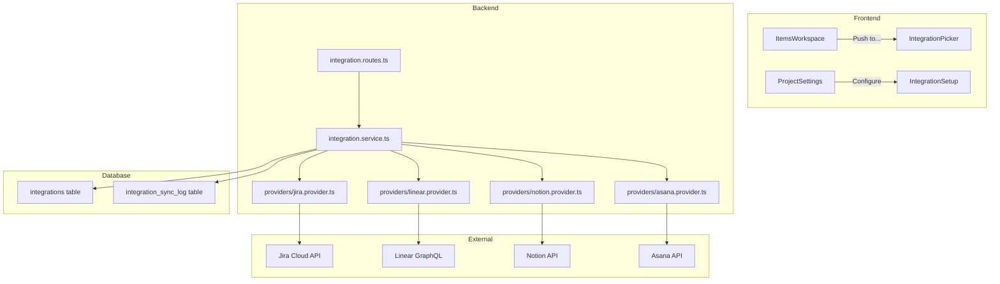

# Task Management Integrations — Push Action Items to External Tools

After a meeting transcript is analyzed, action items should be pushable to the user's preferred task management tool. This turns Meeting AI from a passive note-taker into an **active execution driver** — a major SaaS selling point.

---

## Tool Selection & Prioritization

Based on market share, API quality, and audience fit for a PM-focused product:

| Tool       | Priority | Auth Model              | API Style | Why                                                     |
| ---------- | -------- | ----------------------- | --------- | ------------------------------------------------------- |
| **Jira**   | 🔴 P0    | OAuth 2.0 (3LO)         | REST v3   | #1 in enterprise PM. Every engineering team uses it.    |
| **Linear** | 🔴 P0    | OAuth 2.0               | GraphQL   | Fastest-growing tool among startups & modern teams.     |
| **Notion** | 🟠 P1    | Internal token (shared) | REST      | Massive in PM circles, especially for docs-first teams. |
| **Asana**  | 🟠 P1    | OAuth 2.0 / PAT         | REST      | Strong in non-engineering PM teams.                     |
| **Trello** | 🟡 P2    | API Key + Token         | REST      | Simpler teams, lower complexity. Good for quick wins.   |

> [!IMPORTANT]
> **Recommendation:** Build Jira and Linear first (P0). They cover 80%+ of the target audience for a PM tool. Notion and Asana follow in a second sprint.

---

## Architecture Overview



### Key Design Decisions

1. **Scope: Per-project integrations** — Each project can have its own Jira board, Linear team, Notion database, etc. This aligns with how the app already scopes data.

2. **Provider pattern** — Each integration implements a common `IntegrationProvider` interface. Adding a new tool = adding one provider file.

3. **Push model (not sync)** — We push items when the user clicks "Push to Jira" or when the pipeline completes. We do NOT attempt bidirectional sync (too complex, too many edge cases for v1).

4. **Token storage** — OAuth tokens stored encrypted in the `integrations` table. Refresh tokens handled automatically by the service layer.

---

## Proposed Changes

### Database Layer

#### [NEW] `packages/ai-backend/src/db/schema/integrations.ts`

New schema for storing integration connections and sync history:

```typescript
// integrations — one per (project × provider)
integrations = pgTable('integrations', {
  id: uuid PK,
  projectId: uuid FK → projects,
  organizationId: uuid FK → organizations,
  provider: text ('jira' | 'linear' | 'notion' | 'asana' | 'trello'),
  status: text ('active' | 'disconnected' | 'error'),

  // OAuth tokens (encrypted at rest)
  accessToken: text (encrypted),
  refreshToken: text (nullable, encrypted),
  tokenExpiresAt: timestamp,

  // Provider-specific config
  // Jira: { cloudId, projectKey, issueType }
  // Linear: { teamId, teamName }
  // Notion: { databaseId, databaseName }
  // Asana: { workspaceGid, projectGid, projectName }
  config: jsonb,

  connectedBy: uuid FK → users,
  createdAt, updatedAt
});

// integration_sync_log — audit trail for pushed items
integrationSyncLog = pgTable('integration_sync_log', {
  id: uuid PK,
  integrationId: uuid FK → integrations,
  meetingItemId: uuid FK → meeting_items,
  externalId: text,        // e.g., "PROJ-123" or Linear issue ID
  externalUrl: text,       // link to the created task
  status: text ('success' | 'failed'),
  error: text,
  syncedAt: timestamp,
});
```

#### [NEW] `packages/ai-backend/src/db/schema/migrations/add_integrations.sql`

Drizzle migration for the new tables.

---

### Backend — Provider Interface & Implementations

#### [NEW] `packages/ai-backend/src/integrations/types.ts`

```typescript
interface IntegrationProvider {
  name: string; // 'jira' | 'linear' | 'notion' | 'asana'

  // OAuth flow
  getAuthUrl(state: string): string;
  exchangeCode(code: string): Promise<TokenSet>;
  refreshToken(refreshToken: string): Promise<TokenSet>;

  // Task creation
  createTask(
    token: string,
    config: ProviderConfig,
    item: MeetingItemPayload
  ): Promise<ExternalTask>;
  createTasksBatch(
    token: string,
    config: ProviderConfig,
    items: MeetingItemPayload[]
  ): Promise<ExternalTask[]>;

  // Configuration helpers (fetch available projects/boards/teams)
  listTargets(token: string): Promise<IntegrationTarget[]>;
}
```

#### [NEW] `packages/ai-backend/src/integrations/providers/jira.provider.ts`

- OAuth 2.0 (3LO) flow via Atlassian Connect
- `POST /rest/api/3/issue` to create tasks
- Maps: `priority` → Jira priority, `assignee` → Jira user search, `dueDate` → Jira due date
- `listTargets` → fetches accessible Jira projects via `/rest/api/3/project`

#### [NEW] `packages/ai-backend/src/integrations/providers/linear.provider.ts`

- OAuth 2.0 flow
- GraphQL mutation `issueCreate` to create issues
- Maps: `priority` → Linear priority (0-4), `assignee` → Linear user search
- `listTargets` → GraphQL query for teams

#### [NEW] `packages/ai-backend/src/integrations/providers/notion.provider.ts`

- Internal integration token (user provides their own)
- `POST /v1/pages` to create database items
- Maps item fields to Notion properties (title, status select, date, person)
- `listTargets` → search databases the integration has access to

#### [NEW] `packages/ai-backend/src/integrations/providers/asana.provider.ts`

- OAuth 2.0 or Personal Access Token
- `POST /api/1.0/tasks` to create tasks
- Maps: `priority` → Asana custom field, `assignee` → Asana user, `dueDate` → `due_on`
- `listTargets` → list workspaces and projects

---

### Backend — Routes

#### [NEW] `packages/ai-backend/src/routes/integrations.ts`

| Method   | Path                                                    | Description                                 |
| -------- | ------------------------------------------------------- | ------------------------------------------- |
| `GET`    | `/api/v1/projects/:id/integrations`                     | List integrations for a project             |
| `POST`   | `/api/v1/integrations/oauth/:provider/start`            | Start OAuth flow (returns redirect URL)     |
| `GET`    | `/api/v1/integrations/oauth/:provider/callback`         | OAuth callback (exchanges code for tokens)  |
| `POST`   | `/api/v1/projects/:id/integrations/:provider/configure` | Save provider config (which board/team/db)  |
| `DELETE` | `/api/v1/integrations/:id`                              | Disconnect an integration                   |
| `POST`   | `/api/v1/integrations/:id/push`                         | Push selected items to external tool        |
| `POST`   | `/api/v1/integrations/:id/push-all`                     | Push all pending items from a meeting       |
| `GET`    | `/api/v1/integrations/:id/targets`                      | List available targets (projects/teams/dbs) |
| `GET`    | `/api/v1/integrations/:id/sync-log`                     | View push history                           |

#### [MODIFY] `packages/ai-backend/src/routes/index.ts`

Register `integrationRoutes`.

---

### Frontend — Integration Settings UI

#### [NEW] `packages/web/app/(dashboard)/projects/[id]/integrations/page.tsx`

A dedicated integrations tab/page within the project detail view:

- Shows connected integrations with status
- "Connect" buttons for each available provider with branded icons
- OAuth connection flow (redirect → callback → success)
- Configuration step (select which Jira project / Linear team / Notion database)
- Disconnect button with confirmation

#### [MODIFY] `packages/web/components/items/ItemsWorkspace.tsx`

Add a "Push to [Tool]" button in the toolbar when an integration is active:

- Bulk push: "Push all open items to Jira"
- Per-item push: context menu or button on each row
- Shows sync status (✓ pushed, link to external item)

#### [MODIFY] `packages/web/app/(dashboard)/projects/[id]/page.tsx`

Add "Integrations" section to project detail sidebar or tab navigation.

#### [MODIFY] `packages/web/lib/api.ts`

Add API client functions for all integration endpoints.

---

## User Review Required

> [!IMPORTANT]
> **OAuth App Registration Required**
> To enable Jira and Linear OAuth, you'll need to register developer apps on each platform:
>
> - **Jira**: [Atlassian Developer Console](https://developer.atlassian.com/console/myapps/) — create an OAuth 2.0 (3LO) app
> - **Linear**: [Linear Settings > API](https://linear.app/settings/api) — create an OAuth application
> - **Asana**: [Asana Developer Console](https://app.asana.com/0/my-apps) — register an app
>
> Each will give you a `CLIENT_ID` and `CLIENT_SECRET` to add to your `.env` and Railway config.

> [!WARNING]
> **Notion is different** — Notion uses "internal integrations" where the **user** creates the integration in their workspace and shares a token. We don't do OAuth; instead, the user pastes their Notion integration token into our settings page. This is simpler but means we can't auto-discover things.

---

## Open Questions

1. **Auto-push on pipeline completion?** Should we add an option to auto-push all new action items to the connected tool right after the AI pipeline finishes? Or keep it manual-only for v1?

2. **Field mapping UI?** Some teams use custom Jira fields (e.g., "Epic Link", "Sprint"). Should we build a field mapping UI in v1, or hardcode sensible defaults (summary, description, priority, assignee, due date)?

3. **Which tools first?** I've proposed Jira + Linear for P0. Would you prefer a different prioritization? For example, if your users are more Notion-heavy, we could swap Linear for Notion.

---

## Verification Plan

### Automated Tests

- Unit tests for each provider (mock external API responses)
- Integration test for OAuth callback flow
- Test item → external task field mapping for each provider

### Manual Verification

- Complete OAuth flow for Jira and Linear in development
- Push a real action item from a meeting to each tool
- Verify the external task contains correct title, description, priority, assignee, and due date
- Test disconnect/reconnect flow
- Verify sync log shows pushed items with external links
